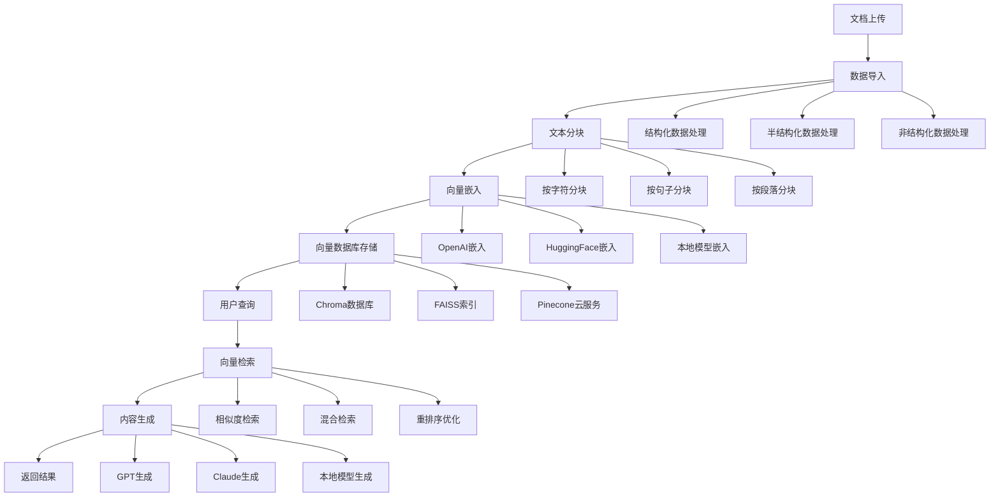

# RAG全流程服务系统

## 项目概述

本项目是一个完整的RAG（Retrieval-Augmented Generation）全流程服务系统，包含数据导入、文本分块、向量嵌入、向量数据库、检索和内容生成等核心模块。系统采用前后端分离架构，提供完整的Web界面和API服务。

## 技术栈

### 前端技术栈
- **Vue2** - 前端框架
- **Webpack** - 构建工具和开发服务器
- **Element UI** - UI组件库
- **Vue Router** - 路由管理
- **Vuex** - 状态管理
- **Axios** - HTTP请求库

### 后端技术栈
- **Python** - 后端语言
- **FastAPI** - Web框架
- **LangChain** - RAG处理框架
- **Chroma/FAISS** - 向量数据库
- **PyPDF2/PyMuPDF** - PDF解析
- **python-docx** - Word文档解析

## 项目结构

```
rag-project/
├── frontend/                    # 前端项目（Vue2 + Webpack）
│   ├── public/
│   │   └── index.html
│   ├── src/
│   │   ├── components/         # 公共组件
│   │   │   ├── Layout/
│   │   │   │   ├── AppLayout.vue      # 主布局组件（1:1:2）
│   │   │   │   ├── Sidebar.vue        # 左侧菜单
│   │   │   │   ├── ConfigPanel.vue    # 中间配置面板
│   │   │   │   └── ResultPanel.vue    # 右侧结果面板
│   │   │   └── Common/
│   │   │       ├── FileUpload.vue     # 文件上传组件
│   │   │       ├── ConfigForm.vue     # 配置表单组件
│   │   │       └── DataTable.vue      # 数据表格组件
│   │   ├── views/              # 页面组件
│   │   │   ├── DataImport/     # 数据导入模块
│   │   │   │   ├── Config.vue         # 配置数据导入
│   │   │   │   └── Management.vue     # 数据导入内容管理
│   │   │   ├── TextChunk/      # 文本分块模块
│   │   │   │   ├── Config.vue
│   │   │   │   └── Management.vue
│   │   │   ├── VectorEmbed/    # 向量嵌入模块
│   │   │   │   ├── Config.vue
│   │   │   │   └── Management.vue
│   │   │   ├── VectorDB/       # 向量数据库模块
│   │   │   │   ├── Config.vue
│   │   │   │   └── Management.vue
│   │   │   ├── Retrieval/      # 检索模块
│   │   │   │   ├── Config.vue
│   │   │   │   └── Management.vue
│   │   │   └── Generation/     # 内容生成模块
│   │   │       ├── Config.vue
│   │   │       └── Management.vue
│   │   ├── router/
│   │   │   └── index.js        # 路由配置
│   │   ├── store/              # Vuex状态管理
│   │   │   ├── index.js
│   │   │   └── modules/
│   │   │       ├── dataImport.js
│   │   │       ├── textChunk.js
│   │   │       ├── vectorEmbed.js
│   │   │       ├── vectorDB.js
│   │   │       ├── retrieval.js
│   │   │       └── generation.js
│   │   ├── api/                # API调用封装
│   │   │   ├── index.js
│   │   │   └── modules/
│   │   │       ├── dataImport.js
│   │   │       ├── textChunk.js
│   │   │       ├── vectorEmbed.js
│   │   │       ├── vectorDB.js
│   │   │       ├── retrieval.js
│   │   │       └── generation.js
│   │   ├── utils/              # 工具函数
│   │   │   ├── request.js      # axios封装
│   │   │   ├── constants.js    # 常量定义
│   │   │   └── helpers.js      # 工具函数
│   │   ├── styles/             # 样式文件
│   │   │   ├── index.css       # 全局样式
│   │   │   └── variables.css   # CSS变量
│   │   ├── App.vue             # 根组件
│   │   └── main.js             # 入口文件
│   ├── package.json
│   ├── webpack.config.js       # Webpack配置文件
│   ├── .babelrc               # Babel配置文件
│   └── .env                    # 环境变量
├── backend/                     # 后端项目
│   ├── main.py                 # 主入口文件
│   ├── services/               # 业务逻辑层
│   │   ├── data_import.py      # 数据导入服务
│   │   ├── text_chunk.py       # 文本分块服务
│   │   ├── vector_embed.py     # 向量嵌入服务
│   │   ├── vector_db.py        # 向量数据库服务
│   │   ├── retrieval.py        # 检索服务
│   │   └── generation.py       # 内容生成服务
│   ├── data/                   # 数据存储目录
│   │   ├── uploads/            # 上传文件
│   │   ├── processed/          # 处理后的数据
│   │   ├── chunks/             # 分块数据
│   │   ├── vectors/            # 向量数据
│   │   └── configs/            # 配置文件
│   ├── models/                 # 数据模型
│   ├── utils/                  # 工具函数
│   └── requirements.txt        # 依赖包
└── README.md                   # 项目文档
```

## RAG模块详细设计

### 1. 数据导入模块

#### 前端界面设计
**配置数据导入页面**：
- 第一行：文件类型选择下拉框
  - 结构化数据：Excel、TXT（表格化数据，有明确的行列结构）
  - 半结构化数据：Markdown文件（有一定格式但不完全规范）
  - 非结构化数据：PDF、Word文档（自由格式文本）
- 第二行：根据文件类型显示具体格式选择
  - 结构化：Excel (.xlsx, .xls)、TXT (.txt, .csv)
  - 半结构化：Markdown (.md)
  - 非结构化：PDF (.pdf)、Word (.docx, .doc)
- 第三行：PDF高级设置（仅非结构化时显示）
  - PyPDF：轻量级解析器，适合简单PDF
  - PyMuPDF：功能强大，支持复杂布局和图像提取
- 第四行：文件上传按钮

**数据导入内容管理页面**：
- 文件列表表格：文件名称、文件大小、文件类型、上传时间、处理状态
- 操作列：预览、删除、重新处理

#### 后端API设计
```python
POST /api/data-import/upload     # 文件上传
GET  /api/data-import/files      # 获取文件列表
GET  /api/data-import/files/{id} # 获取文件详情
DELETE /api/data-import/files/{id} # 删除文件
POST /api/data-import/process/{id} # 重新处理文件
```

### 2. 文本分块模块

#### 配置选项
- 分块策略选择：
  - 按字符数分块：固定字符长度
  - 按句子分块：以句号等标点为界
  - 按段落分块：以换行符为界
  - 自定义分块：用户定义分隔符
- 分块大小设置：每块的字符数或句子数
- 重叠长度设置：相邻块之间的重叠字符数
- 分隔符自定义：自定义分块的分隔符

#### 内容管理
- 分块结果展示：原文本、分块后的文本片段
- 分块统计信息：总块数、平均块大小、重叠率
- 重新分块：修改参数后重新执行分块
- 导出分块数据：导出为JSON或TXT格式

### 3. 向量嵌入模块

#### 配置选项
- 嵌入模型选择：
  - OpenAI模型：text-embedding-ada-002等
  - HuggingFace模型：sentence-transformers等
  - 本地模型：自部署的嵌入模型
- 模型参数配置：API密钥、模型版本、请求参数
- 批处理大小：每次处理的文本块数量
- 缓存设置：是否缓存嵌入结果

#### 内容管理
- 嵌入进度监控：处理进度、剩余时间估算
- 向量信息展示：向量维度、数据类型
- 重新嵌入：更换模型或参数后重新生成向量
- 向量质量评估：相似度分布、聚类分析

### 4. 向量数据库模块

#### 配置选项
- 数据库类型选择：
  - Chroma：轻量级向量数据库
  - FAISS：Facebook开源的相似性搜索库
  - Pinecone：云端向量数据库服务
- 索引配置：索引类型、索引参数
- 相似度算法：余弦相似度、欧几里得距离等
- 数据库连接配置：连接字符串、认证信息

#### 内容管理
- 数据库状态监控：存储量、查询性能
- 索引统计信息：索引大小、构建时间
- 数据库备份/恢复：数据导出导入
- 性能优化：索引重建、参数调优

### 5. 检索模块

#### 配置选项
- 检索算法选择：
  - 相似度检索：基于向量相似度
  - 混合检索：结合关键词和向量检索
  - 重排序：使用重排序模型优化结果
- 返回结果数量：Top-K设置
- 相似度阈值：最低相似度要求
- 检索策略：单轮检索、多轮检索

#### 内容管理
- 检索历史记录：查询记录、结果记录
- 检索效果评估：准确率、召回率分析
- 测试查询：在线测试检索效果
- 结果分析：相似度分布、结果质量评估

### 6. 内容生成模块

#### 配置选项
- 生成模型选择：
  - GPT系列：GPT-3.5、GPT-4等
  - Claude系列：Claude-2、Claude-instant等
  - 本地模型：自部署的大语言模型
- 提示词模板配置：系统提示词、用户提示词模板
- 生成参数设置：
  - 温度（temperature）：控制随机性
  - 最大长度（max_tokens）：生成文本长度限制
  - Top-p：核采样参数
- 上下文窗口大小：检索内容的使用量

#### 内容管理
- 生成历史记录：问题、检索内容、生成结果
- 质量评估：生成质量打分、用户反馈
- 模板管理：提示词模板的增删改查
- A/B测试：不同配置的效果对比

## 前端界面设计规范

### 布局设计（1:1:2比例）
```css
.app-layout {
  display: flex;
  height: 100vh;
}
.sidebar {
  flex: 1;           /* 左侧菜单 */
  min-width: 200px;
}
.config-panel {
  flex: 1;           /* 中间配置区 */
  min-width: 300px;
}
.result-panel {
  flex: 2;           /* 右侧结果区 */
  min-width: 400px;
}
```

### 菜单结构
```
数据导入
├── 配置数据导入
└── 数据导入内容管理

文本分块
├── 配置文本分块
└── 文本分块内容管理

向量嵌入
├── 配置向量嵌入
└── 向量嵌入内容管理

向量数据库
├── 配置向量数据库
└── 向量数据库内容管理

检索
├── 配置检索
└── 检索内容管理

内容生成
├── 配置内容生成
└── 内容生成内容管理
```

### 页面组件规范

#### 配置页面统一结构
- 配置表单区域：使用Element UI表单组件
- 实时预览区域：显示配置效果
- 操作按钮区域：保存、重置、测试按钮
- 配置历史记录：保存的配置版本

#### 内容管理页面统一结构
- 数据表格展示：使用Element UI表格组件
- 搜索筛选功能：条件筛选、关键词搜索
- 批量操作功能：批量删除、批量处理
- 详情查看编辑：弹窗或侧边栏详情

## 后端API设计规范

### 统一API格式
每个模块遵循统一的API设计模式：

```python
# 配置相关API
GET    /api/{module}/config          # 获取当前配置
POST   /api/{module}/config          # 保存新配置
PUT    /api/{module}/config/{id}     # 更新指定配置
DELETE /api/{module}/config/{id}     # 删除指定配置

# 数据处理API
POST   /api/{module}/process         # 执行处理任务
GET    /api/{module}/status/{task_id} # 获取处理状态
POST   /api/{module}/cancel/{task_id} # 取消处理任务

# 内容管理API
GET    /api/{module}/list            # 获取数据列表
GET    /api/{module}/{id}            # 获取单条数据详情
DELETE /api/{module}/{id}            # 删除单条数据
POST   /api/{module}/batch           # 批量操作
```

### 响应格式规范
```json
{
  "code": 200,
  "message": "success",
  "data": {
    // 具体数据
  },
  "timestamp": "2024-01-01T00:00:00Z"
}
```

## 开发环境配置

### 启动后端服务

在项目根目录下，使用以下命令启动后端服务：

```bash
python backend/start.py
```

启动后，服务将在以下地址可用：
- API 文档：http://localhost:8000/docs
- 健康检查：http://localhost:8000/health
- 前端地址：http://localhost:3000（注意：这是前端的地址，不是后端启动的地址）

### 启动前端服务

在frontend目录下，使用以下命令启动前端开发服务器：

```bash
cd frontend
npm install
npm run dev
```

### Webpack配置（webpack.config.js）
```javascript
const path = require('path')
const HtmlWebpackPlugin = require('html-webpack-plugin')
const { VueLoaderPlugin } = require('vue-loader')

module.exports = {
  mode: 'development',
  entry: './src/main.js',
  output: {
    path: path.resolve(__dirname, 'dist'),
    filename: 'bundle.js',
    publicPath: '/'
  },
  resolve: {
    alias: {
      '@': path.resolve(__dirname, 'src'),
      'vue$': 'vue/dist/vue.esm.js'
    },
    extensions: ['.js', '.vue', '.json']
  },
  module: {
    rules: [
      {
        test: /\.vue$/,
        loader: 'vue-loader'
      },
      {
        test: /\.js$/,
        loader: 'babel-loader',
        exclude: /node_modules/
      },
      {
        test: /\.css$/,
        use: ['style-loader', 'css-loader']
      },
      {
        test: /\.(png|jpe?g|gif|svg)(\?.*)?$/,
        type: 'asset/resource'
      },
      {
        test: /\.(woff2?|eot|ttf|otf)(\?.*)?$/,
        type: 'asset/resource'
      }
    ]
  },
  plugins: [
    new VueLoaderPlugin(),
    new HtmlWebpackPlugin({
      template: './index.html',
      filename: 'index.html'
    })
  ],
  devServer: {
    port: 3000,
    hot: true,
    historyApiFallback: true,
    proxy: {
      '/api': {
        target: 'http://localhost:8000',
        changeOrigin: true
      }
    }
  }
}
```

### 前端依赖包
```json
{
  "dependencies": {
    "vue": "^2.7.14",
    "vue-router": "^3.6.5",
    "vuex": "^3.6.2",
    "element-ui": "^2.15.13",
    "axios": "^1.4.0"
  },
  "devDependencies": {
    "webpack": "^5.99.9",
    "webpack-cli": "^5.1.4",
    "webpack-dev-server": "^4.15.1",
    "vue-loader": "^15.11.1",
    "vue-template-compiler": "^2.7.14",
    "babel-loader": "^9.1.3",
    "@babel/core": "^7.23.0",
    "@babel/preset-env": "^7.23.0",
    "css-loader": "^6.8.1",
    "style-loader": "^3.3.3",
    "html-webpack-plugin": "^5.5.3"
  }
}
```

### 后端依赖包
```txt
fastapi==0.104.1
uvicorn==0.24.0
langchain==0.0.350
chromadb==0.4.18
faiss-cpu==1.7.4
PyPDF2==3.0.1
PyMuPDF==1.23.8
python-docx==1.1.0
pandas==2.1.4
numpy==1.24.3
python-multipart==0.0.6
```

## RAG数据流程



## 开发计划

### 第一阶段：基础框架搭建
1. 前端Vue2 + Webpack项目初始化
2. 后端FastAPI项目初始化
3. 基础布局组件开发
4. 路由和状态管理配置

### 第二阶段：数据导入模块
1. 文件上传功能
2. 多格式文件解析
3. 数据存储和管理
4. 前端界面开发

### 第三阶段：文本处理模块
1. 文本分块算法实现
2. 向量嵌入集成
3. 向量数据库集成
4. 配置界面开发

### 第四阶段：检索生成模块
1. 检索算法实现
2. 大语言模型集成
3. 提示词模板管理
4. 结果展示优化

### 第五阶段：系统优化
1. 性能优化
2. 错误处理
3. 日志记录
4. 部署配置

## 注意事项

1. **文件安全**：上传文件需要进行安全检查，限制文件类型和大小
2. **API限制**：对外部API调用进行频率限制和错误重试
3. **数据隐私**：确保用户数据的安全存储和传输
4. **性能监控**：对系统性能进行监控和优化
5. **错误处理**：完善的错误处理和用户提示机制

## 联系方式

如有问题或建议，请联系开发团队。
